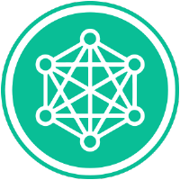

import App from '@site/src/components/ContactForm';
import ConstantContactForm from '@site/src/components/ConstantContactForm';
import Image from '@theme/IdealImage';

## Reach Out

You are lost, overwhelmed, can't figure out where to go, have feedback, want to share an appreciation, don't know how to register for an offering? So many question you might have! Reach out to our Community Support Team and they will happily get back to you within a few days.

<App/>

## Newsletters

We offer two newsletters, one focused on growing Convergent Facilitation capacity (2x a month) and another one focused on impact and application (~6x a year). 

### Growing-Capacity Newsletter

**All events, updates, experiences (~ 25x / year)**: Receive updates on upcoming Convergent Facilitation events as well as new resources. We are usually sending one every other week. If you are signing up for the *Growing-Capacity Newsletter* you will also automatically get the less frequest [Impact and Application Newsletter](#impact-and-application-newsletter).

<ConstantContactForm/>

*Note, if you do not see a signup form above, please send us a [message](#reach-out).* 

### Impact and Application Newsletter

:construction: :seedling: This newsletter is not set up yet. We'll add it here once it is. :seedling: :construction:

## Join the Community on Hylo

To get in touch with others, practice together, and particpate in co-creating a growing library of Convergent Facilitation resources join us in our [Convergent Facilitation group on Hylo](/engage/platforms-and-co-creation/co-create-on-hylo).

